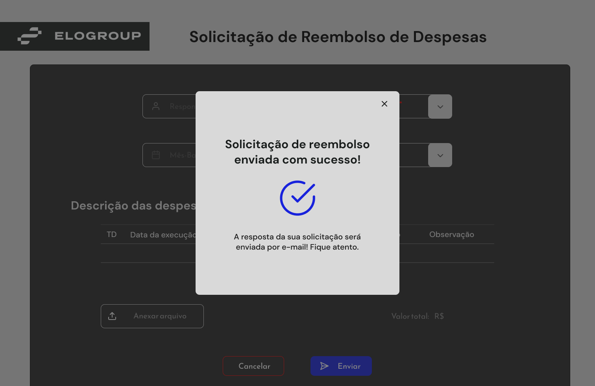
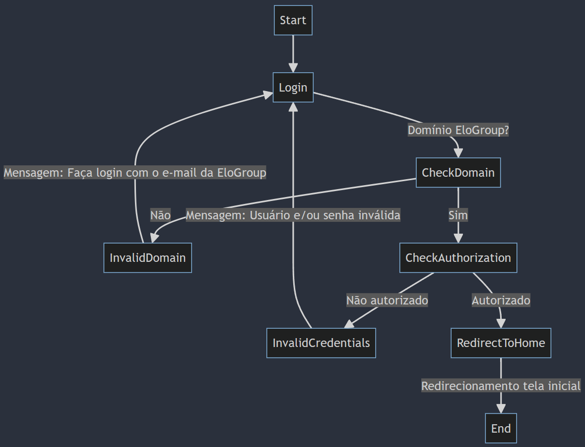
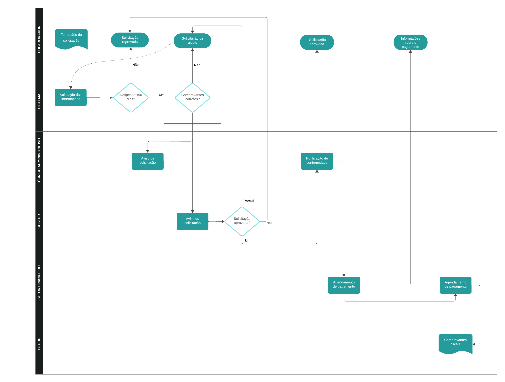

# Sistema de Reembolso de Despesas

<fig>

    <figcaption>Figura 1 - Tela 04 do protótipo - Sucesso ao enviar a solicitação de reembolso.</figcaption>
</fig>

## Ferramentas
* [VSCode](https://www.jetbrains.com/idea/) - IDE para desenvolvimento.
* [Figma](https://www.jetbrains.com/idea/) - Plataforma para design/prototipagem.
* [Mermiad](https://www.jetbrains.com/idea/) - Diagramas.

## Introdução

> O reembolso é um processo pelo qual uma pessoa ou empresa é reembolsada pelo dinheiro gasto em despesas autorizadas. Essas despesas podem variar desde viagens de negócios até a compra de materiais necessários para o trabalho. O sistema de reembolso de despesas é um conjunto de políticas e procedimentos que regulam esse processo, desde a submissão das despesas até a aprovação e o pagamento do reembolso.

O principal objetivo do Sistema de Reembolso de Despesas é facilitar o processo de reembolso de gastos incorridos pelos funcionários em nome da empresa, garantindo transparência, eficiência e conformidade com as políticas financeiras estabelecidas.

**Objetivos gerais**:
* **Transparência financeira**: Garantir que todos os gastos sejam adequadamente documentados e justificados, proporcionando visibilidade total das despesas da empresa.
* **Eficiência operacional**: Simplificar e automatizar o processo de submissão, revisão e aprovação de reembolsos para reduzir o tempo e esforço administrativo necessários.
* **Satisfação do funcionário**: Proporcionar uma experiência positiva para os funcionários, oferencendo um processo de reembolso rápido, justo e transparente.

**Verificações**:
* **Políticas de despesas**: Estabelecer políticas claras que definam quais despesas são reembolsáveis e sob quais condições, incluindo limites de gastos e requisitos de documentação.
* **Aprovação hierárquica**: Processo de aprovação hierárquicos, no qual as despesas são revisadas e aprovadas por técnicos administrativos e gestores ou outras autoridades designadas antes do reembolso.
* **Documentação adequada**: Exigir que os funcionários forneçam documentação adequada, com recibos e faturas, para comprovar cada despesa reembolsável.
* **Autorias periódicas**: Realizar auditorias regulares para revisar os registros de despesas e garantir conformidade com as políticas e regulamentos estabelecidados.
* **Feedback e melhoria contínuna**: Coletar feedback dos funcionários e partes interessadas envolvidades no processo de reembolso para identificar áreas de melhoria e realizar ajustes conforme necessário.

## Análise Técnica
1. **Consistência**:
    * O sistema deve permitir que os funcionários submetam solicitações de reembolso dentro de um período de 90 dias a partir da data da despesa.
    * Os funcionários devem preencher um formulário no sistema e anexar os comprovantes fiscais relacionados às despesas.
    * Após o envio, os comprovantes devem passar por uma verificação automatizada usando tecnologica como Microsoft Power Automate (alternativamente: Oracle).
    * Se os comprovantes estiverem corretos, o sistema deve disparar um e-mail para o técnico administrativo e para o gestor, informando sobre a solicitação e confirmando que todos os documentos necessários estão presentes e dentro do prazo.
    * O gestor deve ter a capacidade de aprovar a solicitação de reembolso de forma total, parcial (solicitando ajustes automáticos por e-mail) ou reprovar a solicitação.
    * Quando aprovada, o setor financeiro deve ser notificado para agendar o pagamento, e o funcionário deve ser informado sobre a aprovação.
    * Após o pagamento ser realizado, o arquivo relacionado ao reembolso deve ser amazenado no repositório de arquivos - AWS S3.
2. **Arquitetura de software**:
    * **Front end**: Utilizar ReactJS para a construção da infarce do usuário, garantindo uma experiência responsiva e amigável.
    * **Back end**: Implementar o back end utiliizando Node.Js com Express, que oferece um ambiente de execução rápido e escalável.
    * **Autenticação**: Implementar o OAuth para garantir a segurança das informações e controlar o acesso dos usuários ao sistema.
    * **Banco de dados**: Utilizar PostgreSQL como banco de dados, devido à sua confiabilidade, rosbustez e suporte a transações complexas.
    * **Integrações**: Integrar o sistema com ferramentas de automação de fluxo de trabalho, como Microsoft Power Automate, para automatizar a verificação de comprovantes fiscais.
    * **Comunicação por e-mail**: Implementar um serviço de e-mail para enviar notificações automáticas aos funcionários, gestores e técnicos administrativos em cada etapa do processo de reembolso.
    * **Armazenamento na nuvem**: Utilizar um serviço de armazenamento em nuvem, como AWS S3, para armazenar os arquivos relacionados aos reembolsos de forma segura e escalável.
3. **Considerações de desempenho e segurança**:
   * Garantir que o sistema seja altamente disponível e escalável para lidar com picos de trafégo durante os períodos de submissão de solicitações de reembolso.
   * Implementar medidas de segurança, como criptografia de dados em repouso e em trânsito, para proteger as informações confidenciais dos funcionários e da empresa.
   * Realizar testes de segurança e vulnerabilidade regularmente para identificar e mitigar possíveis brechas de segurança.
   * Monitorar o desempenho do sistema e otimizar consultar de banco de dados e rotas de API para garantir uma resposta rápida e eficiente.
4. **Processo de desenvolvimento**:
   * Adotar uma abordar ágil de desenvolvimento de software, dividindo o projeto em iterações curtas e entregáveis, permitindo a adaptação e mudanças e feedbacks ao longo do processo.
   * Utilizar ferramentas de controle de versões, como Git ou GitLab, para gerenciar o código-fonte e facilitar a colaboração entre os membros da equipe de desenvolvimento.
   * Realizar teste de unidade, integração e aceitação para garantir a qualidade e confibilidade do software.
   * Implementar integração contínua e implantação contínua (CI/CD) para automatizar o processo de compilação, teste e implementação do software, garantindo uma entrega rápida e consistente.

## Descrição do Ambiente Técnico

O sistema é composto por uma interface web, banco de dados e integrações com automatizações. Funcionalidades principais:

* **F1** - Submissão eletrônica.
* **F2** - Aprovaçao automatizada.
* **F3** - Rastreamento em tempo real.

## Levantamento de Requisitos  

Respeitando a proposta, o sistema deverá atender os seguintes requisitos:

## Requisitos Funcionais
**RF1** - Submissão eletrônica.
  * Os funcionários poderão submeter suas solicitações de reembolso eletronicamente por meio de uma interface amigável.
  * **Funcionalidades incluídas**:
    * **Formulário de submissão**: os funcionários preenchem detalhes da depesa (valor, categoria, despesa) e anexam documentos comprobatórios (fotos, recibos etc.).
    * **Validação de campo**: Verificação de dados obrigatórios e formatos corretos.
    * **Notificações**: Confirmação de recebimento da solicitação.

**RF2** - Aprovação automatizada.
  * Implementar algoritmos para verificar automaticamente certos tipos de reembolsos, acelerando o processo de aprovação.
  * **Funcionalidades incluídas**:
    * **Regras de aprovação**: RN2.
    * **Processamento em lote**: Analisar várias solicitações em um única execução.
    * **Notificações**: Enviar alertas automáticos aos funcionários sobre aprovação ou rejeição.
 
**RF3** - Rastreamento em tempo real.
  * Os funcionários poderão acompanhar o status de suas solicitações em tempo real.
  * **Funcionalidades incluídas**:
    * **Painel do usuário**: Exibir o histórico de solicitações, status atual e detalhes.
    * **Atualizaçãao em tempo real**: Notificar os funcionários sobre mudanças no status (aprovado, rejeitado, previsão de reembolso).

**RF4** - Fluxo de aprovação manual:
  * Após a aprovação automatizada, o sistema enviará um e-mail para o gestor e o técnico administrativo avaliarem.
  * **Funcionalidades incluídas**:
    * **Notificações por e-mail**: Enviar alertar para os responsáveis pela aprovação.
    * **Interface de revisão**: Os gestores e administradores podem visualizar as solicitações e tomar decisões manuais.

**RF5** - Solicitação de pagamento ao setor financeiro.
  * Após o aprovação manual, o sistema enviará um e-mail para o setor financeiro, solicitando o pagamento.
  * **Funcionalidades incluídas**:
    * **Integração com o setor financeiro**: enviar informações relevantes (valor, justificativa, etc.) para processamento de pagamento.

## Requisitos Não Funcionais
**RNF1** - Desempenho.
  * O sistema deve ser capaz de lidar com um grande volume de solicitações de reembolso de forma eficiente, mantendo tempos de respostas baixos mesmo durante os picos de uso.

**RNF2** - Escalabilidade.
  * O sistema deve ser escalável horizontalmente para lidar com o crescimento futuro do número de usuários e da quantidade de dados processados.

**RNF3** - Segurança
  * Todos os dados sensíveis devem ser armazenados de forma segura e protegidos por medidas de criptografia e autenticação robustas para evitar acesso não autorizado.
  * O sistema deve estar em conformidade com regulamentções de proteção de dados, como GDPR (Regulamento Geral de Proteção de Dados) ou LGPD (Lei Geral de Proteção de Dados), dependendo da jurisdição.
  
**RNF4** - Disponibilidade
  * O sistema deve ser altamente disponível, com um tempo de inatividade mínimo planejado para manutenções e atualizações.
  * Deve ser implementada uma estratégia de recuperação de desastres para garantir a continuidade do serviço em caso de falhas de hardware ou software.

**RNF5** - Confiabilidade
  * Deve haver mecanismos de detecção e tratamento de erros para lidar com situações inesperadas de forma adequada, minimizando impactos nos usuários.

**RNF6** - Usabilidade
  * A intereface do usuário deve ser intuitiva e de fácil utilização, garantindo que os funcionários possam submeter solicitações de reembolso sem dificuldades.
  * Deve ser realizada uma avaliação da experiência do usuário para identificar e corrigir eventuais pontos de fricção no processo.

**RN7** - Compatibilidade
  * O sistema deve ser compatível com diferente navegadores web e dispositivos móveis para garantir uma experiência consistente em todas as plataformadas utilizadas pelos funcionários.

## Regras de Negócio

**RGN1** - Solicitação
* O cliente só fará a solicitação se estiver cadastrado e logado.  

**RGN2** - Prazo de submissão
* As solicitações de reembolso devem ser submetidas dentro de um período máximo de 90 dias a partir da data da despesa. Solicitações fora deste prazo serão automaticamente rejeitadas.

**RGN3** - Documentação obrigatória
* Todas as solicitações de reembolso devem incluir documentação adequada, como recibos ou faturas, que comprovem a natureza e o valor da despesa.

**RGN4** - Limite de gastos
* As despesas reembolsáveis estão sujeitas a limites específicos estabelecidos pela política da empresa. Solicitações que excedam esses limites devem passar por uma revisão adicional antes da aprovação.

**RGN5** - Aprovação hieráquica
* As solicitações de reembolso devem ser aprovadas por um gestor ou autoridade designada antes que o pagamento seja processado. A aprovação pode ser concedida de forma total, parcial ou negada.

**RGN6** - Ajustes de solicitações parciais
* Se uma solicitação de reembolso for aprovada parcialmente, o sistema deve gerar automaticamente um e-mail solicitando ajustes ao funcionário, especificando os itens que precisam ser corrigidos ou justificados.

**RGN7** - Armazenamento de documentos
* Todos os documentos relacionados às solicitações de reembolso devem ser armazenados de forma segura e acessível no sistema, garantindo a rastreabilidade e auditoria adequadas.

## Diagramas

### 1. *Login no Sistema*

> O objetivo do fluxo do login é autenticar os usuários e permitir que eles acessem o sistema de forma segura.

<fig>

    <figcaption>Figura 2 - Representação do funcionamento do login.</figcaption>
</fig>

**1.1. Início**: O fluxo começa com o usuário tentando fazer login no sistema.

**1.2. Verificação de domínio (CheckDomain)**:
* O sistema verifica se o domínio do e-mail pertence à "EloGroup".
* Se o domínio não for "EloGroup", o usuário é instruído a fazer login com um e-mail da EloGroup.
* Caso contrário, o fluxo continua para a próxima etapa.

**1.3. Verifica de autorização (CheckAuthorization)**:
* O sistema verifica se o login é autorizado.
* Se não autorizado (ou seja, nome de usuário ou senha inválida), exibe uma mensagem de erro.
* Se for autorizado, o usuário é redirecionado para a tela inicial do sistema.

**1.4. Redirecionamento para a tela inicial (RedirectToHome)**:
* Após a autorização bem-sucedida, o fluxo redireciona o usuário para a tela inicial do sistema.

### 2. *Funcionamento do Sistema*
<fig>

    <figcaption>Figura 3 - Representação do funcionamento do sistema.</figcaption>
</fig>

## Cenários de Teste e Critérios de Aceitação

### Critérios de Teste Funcional

**1. Submissão de solicitação de reembolso**:
* **Cenário**: Um funcionário submete uma solicitação de reembolso eletronicamente.
* **Critério de aceitação**: A solicitação é registrada corretamente no sistema, todos os campos obrigatórios são preenchidos e os documentos anexados são salvos com sucesso.

**2. Aprovação automatizada**:
* Cenário: Uma solicitação de reembolso é processada automaticamente pelo sistema.
* Critério de aceitação: O sistema aplica as regras de aprovação corretamente, notifica os usuários relevantes e registra o status de aprovação/rejeição de forma precisa.

**3. Rastreamento em tempo real**:
* Cenário: Um funcionário verifica o status atual de sua solicitação de reembolso.
* Critério de aceitação: O sistema exibe corretamente o status atual da solicitação do funcionário, incluindo se está pendente, aprovada ou rejeitada, e fornece atualizações em tempo real conforme necessário.

**4. Fluxo de aprovação manual**:
* Cenário: Um gestor revisa e aprova uma solicitação de reembolso manualmente.
* Critério de aceitação: O gestor recebe a solicitação para revisão, pode visualizar os detalhes completos da solicitação, aprovar parcialmente ou total ou reprovar totalmente e fornecer feedback ao funcionário conforme necessário.

**5. Integração com o setor financeiro**:
* Cenário: O setor financeiro recebe uma solicitação de pagamento após a aprovação.
* Critério de aceitação: O setor financeiro recebe todas as informações necessárias para processar o pagamento, incluindo valor, informações da aprovação e justificativa, e confirma a conclusão do pagamento no sistema.

### Critérios de Teste Não Funcional
**1. Desempenho**:
* Cenário: Um grande volume de solicitações de reembolso é submetido ao sistema simultaneamente.
* Critério de aceitação: O sistema mantém tempos de resposta aceitáveis mesmo durante períodos de pico de uso e é capaz de escalar horizontalmente conforme necessário para lidar com a carga adicional.

**2. Segurança**:
* Cenário: Um usuário tenta acessar dados confidenciais sem autorização.
* Critério de aceitação: O sistema impede o acesso não autorizado, protege os dados sensíveis por meio de criptografia e autenticação robusta e cumpre todas as regulamentações de proteção de dados relevantes.

**3. Usabilidade**:
* Cenário: Um novo funcionário utiliza o sistema pela primeira vez para submeter uma solicitação de reembolso.
* Critério de aceitação: O funcionário consegue navegar facilmente pelo sistema, entender as etapas necessárias para submeter uma solicitação e receber feedback claro sobre o progresso da solicitação.

**4. Compatibilidade**:
* Cenário: Um funcionário tenta acessar o sistema usando diferentes navegadores da web e dispositivos móveis.
* Critério de aceitação: O sistema é compatível com uma variedade de navegadores da web (por exemplo, Chrome, Firefox, Safari) e oferece uma experiência de usuário consistente em diferentes dispositivos móveis.

**5. Recuperação de desastres**:
* Cenário: O sistema enfrenta uma falha de hardware ou software inesperada.
* Critério de aceitação: O sistema é capaz de se recuperar da falha de forma rápida e eficiente, minimizando o impacto nos usuários e garantindo a continuidade do serviço.

### Critérios de Teste de Integração
**1. Integração com ferramentas externas**:
* Critérios: O sistema se integra com ferramentas externas, como Microsoft Power Automate.
* Verificação: Verificar se as integrações estão configuradas corretamente e se os dados são transmitidos entre os sistemas de forma eficaz.

**2. Comunicação por e-mail**:
* Critério: O sistema envia notificaçõees automáticas por e-mail nnas etapas do processo de reembolso.
* Verificação: Verificar se os e-mails são enviados corretamente e se contêm informações precisas sobre o status de solicitações.

#
